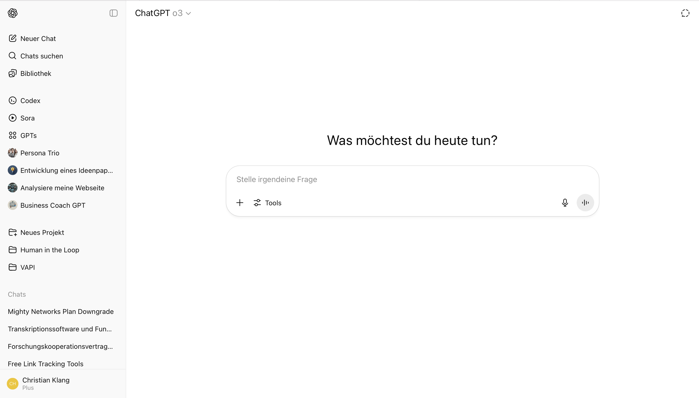

Hier findest du eine Übersicht der Funktionen von ChatGPT. Da es mittlerweile recht umfangreich ist, sind einige Funktionen etwas versteckt - oder im ChatGPT Plus Plan (23€) enthalten.

- Kann Dokumente lesen und durchsuchen. Kann über das "Canvas" Feature auch Texte überarbeiten. Kann per "Code Interpreter" auch Dokumente erstellen und als Download-Link bereitstellen (funktioniert nicht immer).
- Kann Code lesen und per "Canvas" Feature überarbeiten. Einfachen Code, z.B. eine HTML Webseite, kann es auch anzeigen. Kann selbst auch Code als Datei-Download bereitstellen.
- Hat mit "Codex" neuerdings eine Funktion zum Programmieren.
- Kann Chats, Anweisungen und Dokumente sortieren in Projekte.
- Kann per Sprache kommunizieren. Die Sprachen lassen sich in den Einstellungen wechseln.
- Hat mit Sora ein starkes Modell zur **Videogenerierung** und mit GPT-Image ein gutes Modell zur **Bildgenerierung**.
- Kann "Custom GPT" erstellen und teilen. Diese Agenten enthalten eigene Dokumente und Anweisungen. Agenten kann man mit jeder Person teilen, auch welche ohne Plus-Abo.

## Datenhoheit

Für sehr große Kunden ist ChatGPT auch auf Europäischen Servern verfügbar. Normalerweise läuft alles außerhalb der EU.

Per Inkognito-Modus kann man ChatGPT mitteilen, dass ein Chatverlauf nicht für Trainingszwecke genutzt werden soll.
