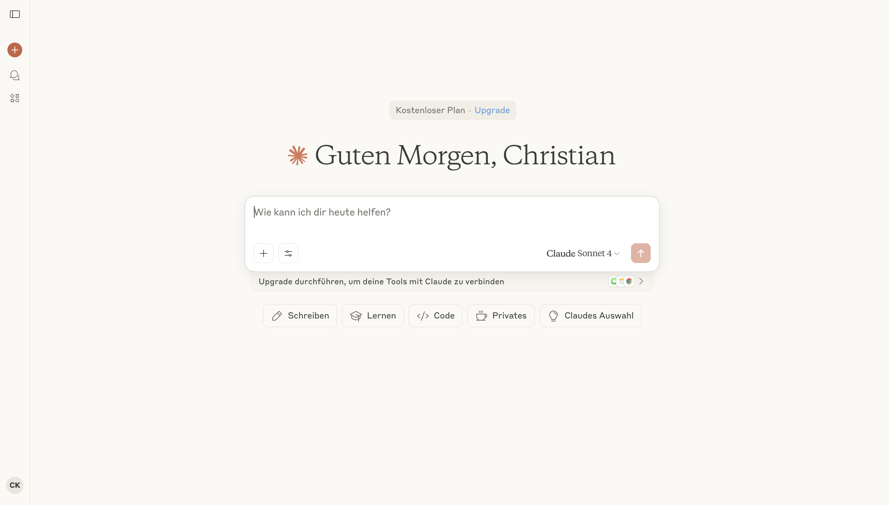

# Kann Dokumente lesen und durchsuchen. Kann auch Dokumente erstellen und als Download-Link bereitstellen.
- Kann Code lesen und per "Artifacts" Feature überarbeiten. Kann selbst auch Code als Datei-Download bereitstellen.
- Kann über das "Artifacts" Feature auch Texte überarbeiten und sogar kleine Apps #programmieren. Die Artefakte-Galerie entwickelt sich immer mehr zum App Store.
- Kann Chats, Anweisungen und Dokumente in #Projekte unterordnen.
- Kann über Konnektoren und Integrationen mit immer mehr Drittanbietern kommunizieren, z.B. Gmail.
- Im Menü gibt es die Möglichkeit, einen eigenen Schreibstil zu hinterlegen.
- Es gibt eine #Desktop-App mit der Möglichkeit, selbst eigene Programmierschnittstellen und MCP-Server anzusteuern.

## Datenhoheit

Für sehr große Kunden ist Claude auch auf Europäischen Servern verfügbar. Normalerweise läuft alles außerhalb der EU.

Der Chatverlauf wird nach eigener Aussage nicht für Trainingszwecke genutzt.
