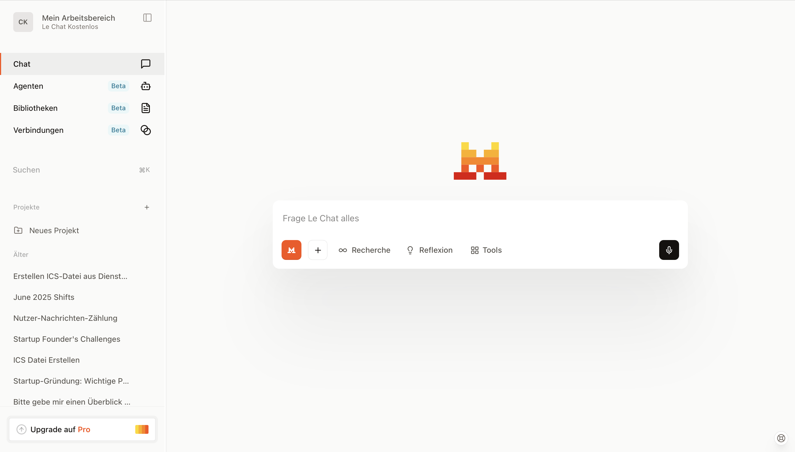

- Kann Dokumente lesen und durchsuchen. Kann auch Dokumente erstellen und als Download-Link bereitstellen. Kann übersichtlich alle Dokumente in einer Bibliothek anzeigen.
- Kann Code lesen und per "Canvas" Feature überarbeiten. Kann selbst auch Code als Datei-Download bereitstellen ("Code Interpreter").
- Kann Chats, Anweisungen und Dokumente in #Projekte unterordnen.
- Kann über Konnektoren und Verbindungen mit immer mehr Drittanbietern kommunizieren, z.B. Gmail.
- Kann "Agenten" erstellen und teilen. Diese Agenten enthalten eigene Dokumente und Anweisungen. Agenten kann man im Team teilen.

Normalerweise läuft alles innerhalb der EU.

Das Trainieren der Modelle mit Nutzer-Chats ist für Einzelnutzer standardmäßig an, man kann es aber [deaktivieren](https://help.mistral.ai/en/articles/347614-can-i-opt-out-of-my-input-or-output-data-being-used-for-training). Für Unternehmen ist es standardmäßig aus.