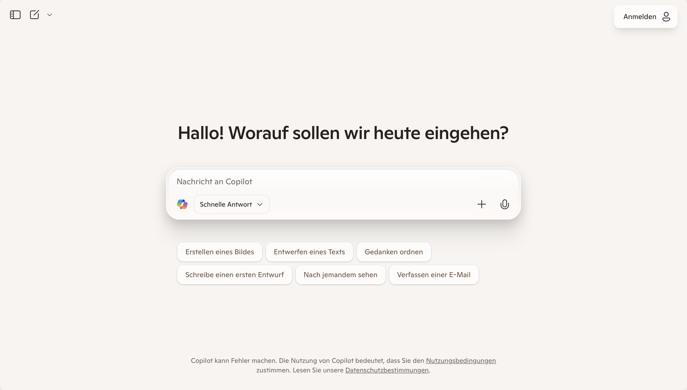

- Das Große Sprachmodell von Microsoft heisst Prometheus, das auf Modellen von OpenAI (ChatGPT) aufbaut. Microsoft ist übrigens einer der Investoren von OpenAI.
- Kann Dokumente lesen und durchsuchen. Kann per "Code Interpreter" auch Dokumente erstellen und als Download-Link bereitstellen.
- Kann Code lesen und überarbeiten. Kann selbst auch Code als Datei-Download bereitstellen.
- Hat eine Diktierfunktion im Browser.
- Kann #Bildgenerierung.
- Kann Agenten erstellen und teilen. Diese Agenten enthalten eigene Dokumente und Anweisungen.

## Datenhoheit

Für Unternehmenskunden liegen die Daten der Chats [standardmäßig](https://learn.microsoft.com/en-us/copilot/microsoft-365/enterprise-data-protection) in der EU. Bei Privatkunden ist das nicht der Fall.

Chatverläufe werden standardmäßig nicht für Trainingszwecke genutzt.