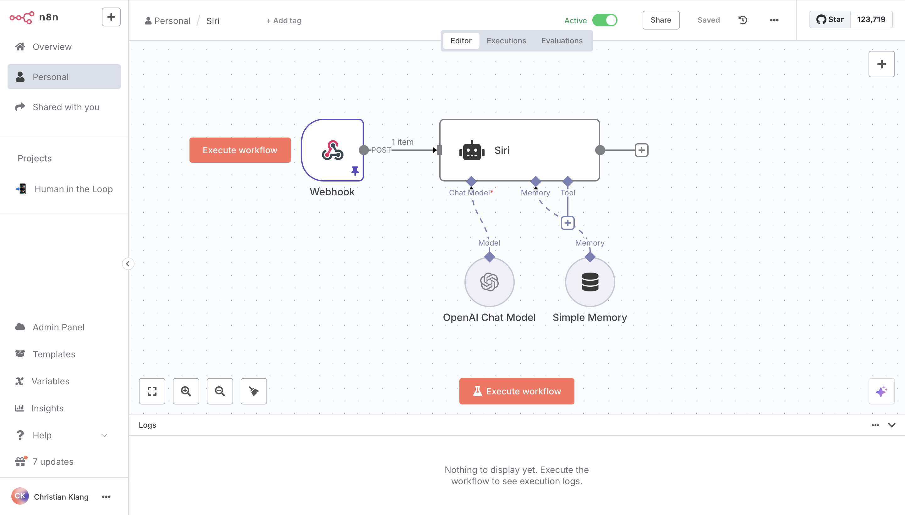

- Du kannst Workflows visuell bauen, eine Funktion oder ein Verknüpfung ist ein Node. Du kannst mit vordefinierten Schnittstellen (z.B. E-Mail, Slack), offenen APIs oder Webhooks Verbindungen aufbauen.
- n8n kann auch Daten transformieren, filtern und anreichern. Kann Code ausführen.
- Kann Ergebnisse als Datei bereitstellen oder an externe Dienste schicken.
- Kann Große Sprachmodelle integrieren (OpenAI, Anthropic, HuggingFace etc.) – die gesamte Konfiguration findet direkt im Workflow statt.
- Die “KI-Agenten” gehen noch einen Schritt weiter: Sie können selbstständig Tools ausführen (z.B. ein Dokument erstellen, eine E-mail schreiben), wenn entsprechend angeleitet wurden und sogar Nachfragen stellen, wenn Ihnen dazu noch Informationen fehlen. Sie haben ein Gedächtnis. Mehr Infos hier.
- Kann Workflows versionieren und klonen oder als JSON exportieren. Dokumentiert Fehler und kann Fehler-Workflows anstoßen.
- Kann im Team bearbeitet werden: Rollen, geteilte Zugangsdaten von Tools.
- Wer einen Chatbot auf seine Webseite einbetten will, für den hat n8n ein “Chat Embed”, das man ohne Code anpassen kann.

## Datenhoheit

Open Source – und vollständig selbstgehostet möglich (Docker, Kubernetes). In der Cloud-Version ist es innerhalb der EU.

Credentials werden verschlüsselt gespeichert und sensible Daten können als Environment-Variablen verwaltet werden. Wer n8n selbst hostet, kontrolliert alle Datenströme.