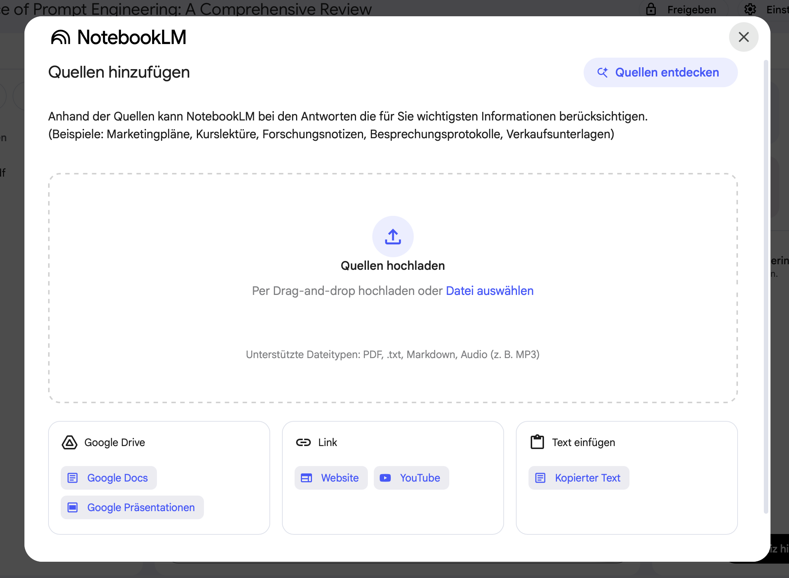
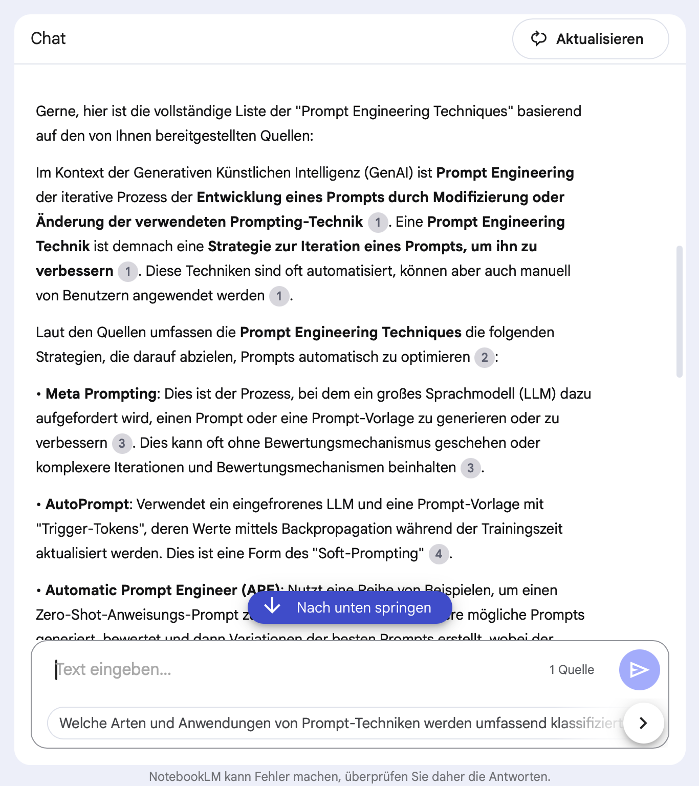
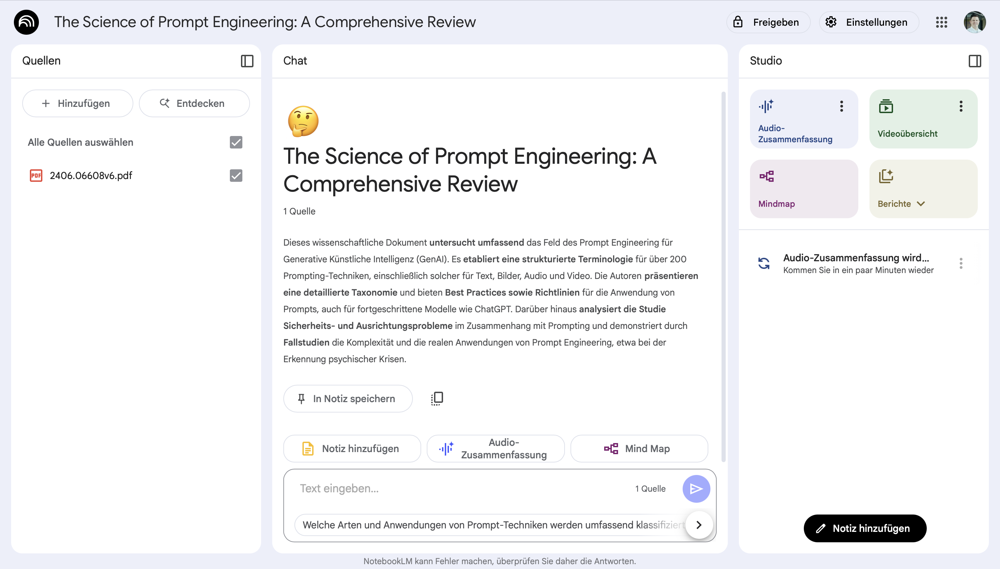

Wer es unbegrenzt nützen möchte, bezahlt nach einer Testphase 8,10 € pro Monat extra für sein Google Workspace-Konto.

- Du legst Ordner an, innerhalb derer du mit Quellen chatten kannst. Hinter NotebookLM steckt das Große Sprachmodell Gemini (wahrscheinlich Gemini 1.5 Pro). Die Gemini-Modelle haben aktuell die größten Kontextfenster aller Großen Sprachmodelle. Sie können also auch lange Dokumente durchsuchen.
- Als Quellen können PDFs, Bilder, Text-Dokumente, Webseiten, Videos oder Audio-Dateien dienen. Die Gemini-Modelle sind traditionell sehr gut darin, unterschiedliche Medien zu verarbeiten und zu ‘lesen’.
- Es gibt neuerdings eine mobile App, mit der du unterwegs Medien oder Dokumente analysieren kannst.

Das beste Feature von NotebookLM ist sicherlich ihre “Nadel im Heuhaufen”-Suche: Es kann Dir bestimmte Text-Passagen heraussuchen und dann direkt im Chat verlinken. Praktisch, wenn man etwas Bestimmtes sucht.

- Unter dem Chat-Fenster findest du immer weitere interessante Anfragen für deine Quellen, was es interessant für das Selbststudium macht.
- Du kannst Quellen auf der linken Seite an- und abwählen. Nur die gewählten Quellen werden für den Chat verwendet.
- Die **Audio-Zusammenfassung** generiert dir eine Audio-Zusammenfassung im Podcast-Stil, bei der sich zwei KI-Stimmen unterhalten. Sehr beeindruckend! Wenn du also mal ein kompliziertes wissenschaftliches Paper hast, das du beim Pendeln hören möchtest, ist das eine super Möglichkeit. Neuerdings sind die deutschen Stimmen auch sehr gut.

- Das neue Mindmap Feature ist eine Interaktive Karte, auf der du dich durch die einzelnen (von der KI-generierten) Themen klicken kannst. Super, um die Zusammenhänge zu verstehen. Klickst du auf einen Knoten, erklärt dir der Chat den Hintergrund und nennt dir die Quellen.
- Unter Berichte verbergen sich ein KI-generierter Überblick, eine Arbeitshilfe, ein FAQ und eine Zeitachse. Im Grunde sind das weitere Möglichkeiten, das Thema zu durchdringen, beispielsweise für eine Recherche-Arbeit. Natürlich kann man auch hier Halluzinationen nicht ausschließen, aber durch die Quellenangaben kannst du alle Ergebnisse schnell überprüfen, bzw. direkt zu den Originalquellen springen.
- Die neue **Videoübersicht** ist eine Präsentation des Themas, erklärt von einer KI-Stimme. Es ist im Grunde ein kleines E-Learning-Modul mit Präsentationsfolien zu dem Thema, in dem die KI dir die wichtigsten Konzepte erklärt. Aktuell nur auf Englisch verfügbar. Revolutioniert Google hier den E-Learning-Markt? Es funktioniert jetzt schon sehr gut.

## Videoübersicht

Hier ist ein Video, das NotebookLM mir innerhalb von 10 Minuten generiert hat. Die einzige Quelle war ein [wissenschaftliches Paper](https://arxiv.org/abs/2406.06608) zu Prompt-Techniken als PDF. Darüber hinaus habe ich keine Instruktionen gegeben, ich habe einfach nur auf den Button geklickt. Mit ein paar Anweisungen (und in Deutscher Sprache) wäre dieses Feature sicherlich in der Lage, einige langweilige Selbstlern-Videos zu ersetzen. Wer nicht warten kann, ElevenLabs könnte dieses Video zu Deutsch synchronisieren.

<video
  controls
  className="w-full aspect-video rounded-xl"
  src="From_Chaos_to_Control.mp4"
></video>

## Datenhoheit

Die hochgeladenen Dokumente liegen auf einem Google-Server. Für Google Workspace Nutzer liegen die Daten in der EU. Laut eigener Angabe werden keine Daten für das Training von KI-Modellen genutzt oder anderweitig verarbeitet.

Normalerweise sind keine Dokumente öffentlich, sie können aber mit anderen Google-Konten geteilt werden. Private Google-Konten können ganze Ordner öffentlich machen.